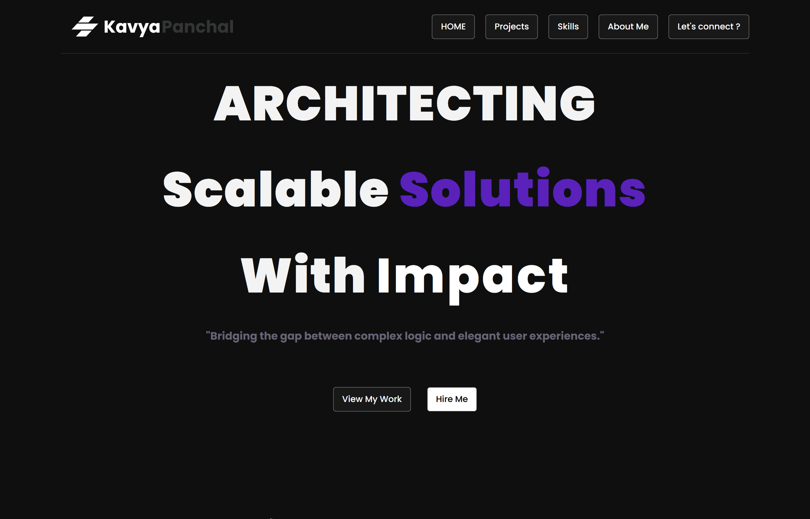
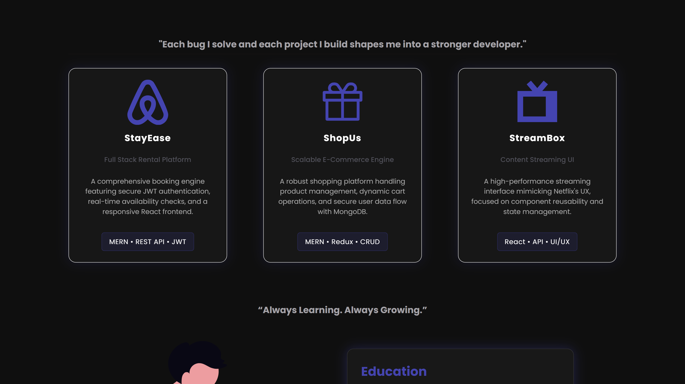

✨ Personal Portfolio Website

A beautifully crafted, modern portfolio website built using HTML, CSS, and JavaScript.
It highlights my projects, skills, and journey as a growing developer, with a clean UI and smooth user experience.

## 📸 Portfolio Preview

### 🧩 Hero Section

### 🚀 Projects

🌟 Highlights

🎨 Minimal & modern design

📱 Fully responsive layout

⚡ Fast and lightweight

🧩 Organized sections for projects, skills & contact

🚀 Shows my growth and learning journey

🛠️ Tech Stack
Technology	   Description
HTML5	         Structure and content
CSS3	         Styling, layout, animations
JavaScript	   Interactivity + dynamic behaviour(Only for responsive now)

🎯 Purpose

This portfolio represents who I am, what I’m learning, and the real-world projects I'm building as I grow in web development and software engineering.
It serves as a digital identity for recruiters and opportunities.

🌐 Live Demo

👉 https://aikavya.github.io/PortfolioMade/

🤝 Connect With Me

Let’s connect and collaborate!

🔗 LinkedIn: https://www.linkedin.com/in/kavya-panchal-399ab727a/

🐙 GitHub: aikavya

📧 Email: kavya2310.kp@gmail.com
